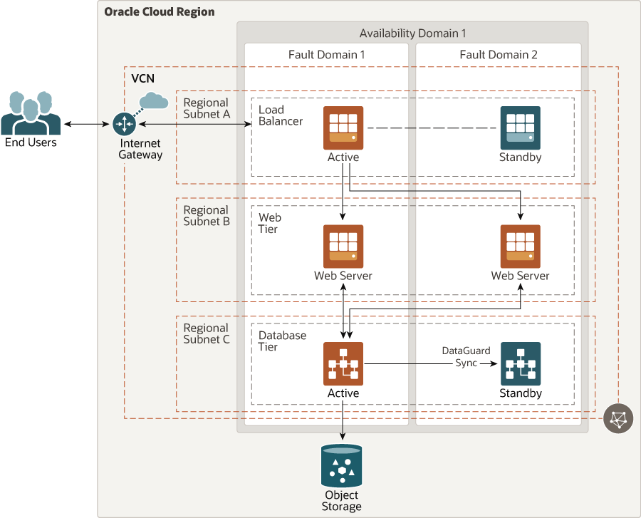

# oci-arch-web-ha

Web applications typically include a web client, servers, and a datastore. Flask is a popular Python framework for developing web applications quickly and easily.

This reference architecture uses a sample Flask application that interacts with an Oracle Database on the backend. The application is containerized using Docker, and the reference architecture is deployed to Oracle Cloud Infrastructure.

## Terraform Provider for Oracle Cloud Infrastructure
The OCI Terraform Provider is now available for automatic download through the Terraform Provider Registry. 
For more information on how to get started view the [documentation](https://www.terraform.io/docs/providers/oci/index.html) 
and [setup guide](https://www.terraform.io/docs/providers/oci/guides/version-3-upgrade.html).

* [Documentation](https://www.terraform.io/docs/providers/oci/index.html)
* [OCI forums](https://cloudcustomerconnect.oracle.com/resources/9c8fa8f96f/summary)
* [Github issues](https://github.com/terraform-providers/terraform-provider-oci/issues)
* [Troubleshooting](https://www.terraform.io/docs/providers/oci/guides/guides/troubleshooting.html)

## Clone the Module
Now, you'll want a local copy of this repo. You can make that with the commands:

    git clone https://github.com/oracle-quickstart/oci-arch-web-ha.git
    cd oci-arch-web-ha
    ls

## Prerequisites
First off, you'll need to do some pre-deploy setup.  That's all detailed [here](https://github.com/cloud-partners/oci-prerequisites).

Secondly, create a `terraform.tfvars` file and populate with the following information:

```
# Authentication
tenancy_ocid         = "<tenancy_ocid>"
user_ocid            = "<user_ocid>"
fingerprint          = "<finger_print>"
private_key_path     = "<pem_private_key_path>"

# SSH Keys
ssh_public_key  = "<public_ssh_key_path>"

# Region
region = "<oci_region>"

# Compartment
compartment_ocid = "<compartment_ocid>"

````

Deploy:

    terraform init
    terraform plan
    terraform apply

## Destroy the Deployment
When you no longer need the deployment, you can run this command to destroy it:

    terraform destroy

## Web Application Architecture




## Reference Archirecture

- [Deploy a highly available web application](https://docs.oracle.com/en/solutions/ha-web-app/index.html)
